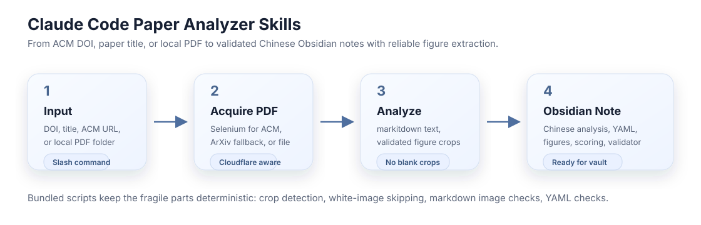
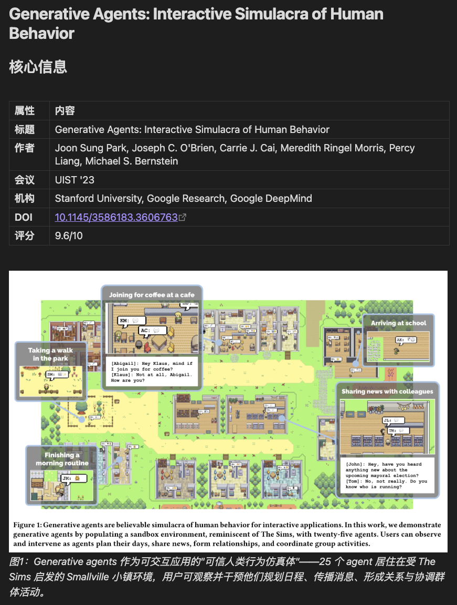
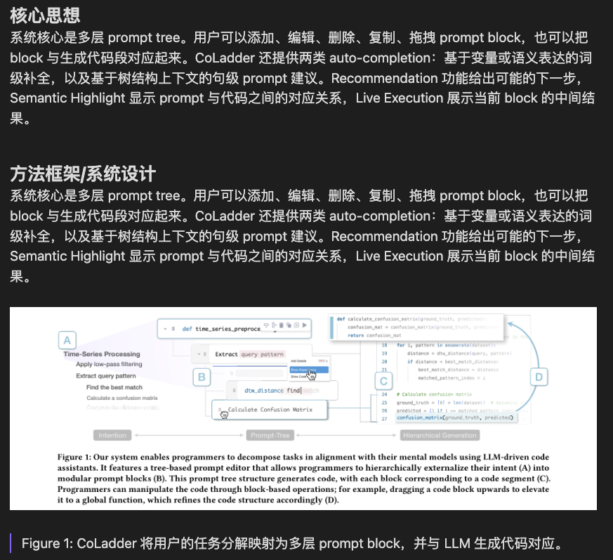

# Claude Code Paper Analyzer Skills

Turn ACM papers and local PDFs into structured Chinese Obsidian notes with extracted figures, scoring, and post-generation validation.

<p>
  <a href="LICENSE"></a>
  
  
  
</p>

> Built on top of [evil-read-arxiv](https://github.com/juliye2025/evil-read-arxiv), extending its paper-analysis workflow from arXiv to ACM Digital Library and arbitrary local PDFs. It uses the same `20_Research/Papers/` Obsidian vault layout for smooth interoperability.



## Why This Exists

Reading papers is already expensive. Rebuilding the same Obsidian structure, translating abstracts, copying metadata, cropping figures, and checking broken image links should not be.

This repository provides two Claude Code skills:

| Skill | Slash command | Use it when |
|---|---|---|
| `acm-paper-analyze` | `/acm-paper-analyze` | You have an ACM DOI, DOI URL, ACM URL, or paper title |
| `pdf-paper-analyze` | `/pdf-paper-analyze` | You already have one PDF or a directory of PDFs |

Both skills generate Chinese paper notes with:

- strict YAML frontmatter for search and filtering;
- Chinese abstract translation and key takeaways;
- background, method, results, limitations, and evaluation sections;
- reliable figure/table crops saved beside the note;
- a 5-dimension quality score;
- a validator for broken image refs, mostly white figures, YAML, tags, and image-caption spacing.

## Example Output

The generated notes are designed for actual reading in Obsidian, not just archival storage.

| Metadata + Figure Embedding | Method Section + Caption |
|---|---|
|  |  |

## Installation

### 1. Clone the Repository

```bash
git clone https://github.com/SLEEPYBQ/claude-code-paper-analyzer-skills.git
cd claude-code-paper-analyzer-skills
```

### 2. Install the Skills

```bash
mkdir -p ~/.claude/skills
cp -r acm-paper-analyze ~/.claude/skills/
cp -r pdf-paper-analyze ~/.claude/skills/
```

After copying, restart Claude Code if it is already running. The commands should appear when you type `/`.

### 3. Configure Your Obsidian Vault

Set `OBSIDIAN_VAULT_PATH` to the root of your Obsidian vault:

```bash
echo 'export OBSIDIAN_VAULT_PATH="/path/to/your/obsidian-vault"' >> ~/.zshrc
source ~/.zshrc
mkdir -p "$OBSIDIAN_VAULT_PATH/20_Research/Papers"
```

Expected layout:

```text
Your Vault/
└── 20_Research/
    └── Papers/
        ├── HCI_AI/
        ├── AgentMemory/
        └── ...
```

### 4. Install Python Dependencies

Python 3.10+ is required.

Using Conda:

```bash
conda create -n paper-analyze python=3.11 -y
conda activate paper-analyze
pip install "markitdown[pdf] @ git+https://github.com/microsoft/markitdown.git#subdirectory=packages/markitdown"
pip install PyMuPDF selenium
```

Using `venv`:

```bash
python3.11 -m venv ~/.venvs/paper-analyze
source ~/.venvs/paper-analyze/bin/activate
pip install "markitdown[pdf] @ git+https://github.com/microsoft/markitdown.git#subdirectory=packages/markitdown"
pip install PyMuPDF selenium
```

Verify:

```bash
python -c "from markitdown import MarkItDown; import fitz; print('ready')"
```

### 5. Install Chrome for ACM Downloads

`acm-paper-analyze` uses Selenium with Chrome because ACM Digital Library often blocks direct PDF downloads.

- macOS: `brew install --cask google-chrome`
- Windows: install Chrome from <https://www.google.com/chrome/>
- Linux: install `google-chrome-stable` or Chromium through your package manager

Selenium 4+ manages ChromeDriver automatically in most environments.

## Usage

### Analyze an ACM Paper

```text
/acm-paper-analyze 10.1145/3772318.3791819
```

```text
/acm-paper-analyze https://doi.org/10.1145/3772318.3791819
```

```text
/acm-paper-analyze "Towards human-ai deliberation: Design and evaluation of llm-empowered deliberative ai"
```

The skill tries ACM first. If ACM is blocked and an arXiv version exists, it falls back to arXiv. If both fail, download the PDF manually and use `/pdf-paper-analyze`.

### Analyze Local PDFs

Single PDF:

```text
/pdf-paper-analyze /path/to/paper.pdf
```

Path with spaces:

```text
/pdf-paper-analyze "/Users/me/Library/Mobile Documents/iCloud~md~obsidian/Documents/papers/paper.pdf"
```

Directory of PDFs:

```text
/pdf-paper-analyze /path/to/papers/
```

Manual domain override:

```text
/pdf-paper-analyze /path/to/paper.pdf --domain AgentMemory
```

## Output Structure

Each paper gets its own directory:

```text
$OBSIDIAN_VAULT_PATH/20_Research/Papers/
└── HCI_AI/
    └── Paper_Title/
        ├── Paper Title.md
        └── images/
            ├── fig1_page3.png
            ├── table1_page8.png
            └── ...
```

Generated notes follow this shape:

```markdown
---
date: "2026-05-25"
paper_id: "10.1145/..."
title: "Paper Title"
authors: "Author1, Author2"
domain: "HCI_AI"
tags:
  - 论文笔记
  - HCI-AI
  - Human-AI-Collaboration
quality_score: "8.5/10"
created: "2026-05-25"
updated: "2026-05-25"
status: analyzed
---

# Paper Title

## 核心信息
## 摘要翻译
### 核心要点提炼
## 研究背景与动机
## 方法概述
## 实验结果
## 深度分析
## 我的综合评价
```

## Reliable Figure Extraction

The bundled extractor avoids the common "blank crop" failure mode in ACM/CHI papers, where a caption appears at the bottom of one page but the actual figure is on another page.

Instead of trusting captions alone, `scripts/extract_figures.py` checks:

- embedded image bounding boxes;
- vector drawing bounding boxes;
- whether visual content is adjacent to the caption;
- crop size;
- whether the rendered crop is more than 95% white pixels.

Image names are stable and local to each note:

```text
fig2_page3.png
table1_page8.png
page5.png
```

## Validation

Each skill includes `scripts/validate_note.py`.

Run it after generating a note:

```bash
python3 ~/.claude/skills/pdf-paper-analyze/scripts/validate_note.py "/path/to/Paper Title.md" --fix
python3 ~/.claude/skills/pdf-paper-analyze/scripts/validate_note.py "/path/to/Paper Title.md"
```

The validator checks:

- broken `images/*.png` references;
- referenced images that are mostly white;
- missing blank lines between images and blockquote captions;
- missing `Figure N:` or `Table N:` captions;
- common YAML string fields without double quotes;
- `quality_score` format;
- tag names containing spaces.

## Domain Inference

If no domain is provided, the skill infers one from paper content and existing vault directories.

| Keywords | Inferred domain |
|---|---|
| agent, multi-agent, orchestration, swarm | Agent |
| memory, personalization, user modeling | AgentMemory |
| HCI, user study, interface, interaction, CHI | HCI_AI |
| language model, LLM, transformer | LLM |
| vision, image, video, multimodal | Multimodal |
| reinforcement learning, RL, reward | RL_LLM_Agent |
| diffusion, generation, synthesis | Diffusion |

Existing matching subdirectories in `20_Research/Papers/` are preferred.

## Repository Layout

```text
.
├── acm-paper-analyze/
│   ├── skill.md
│   └── scripts/
│       ├── extract_figures.py
│       └── validate_note.py
├── pdf-paper-analyze/
│   ├── skill.md
│   └── scripts/
│       ├── extract_figures.py
│       └── validate_note.py
├── figures/
│   ├── workflow.svg
│   ├── fig1.png
│   └── fig2.png
└── README.md
```

## Compatibility

- Designed for [Claude Code](https://docs.anthropic.com/en/docs/claude-code) skills.
- Compatible with the vault layout used by [evil-read-arxiv](https://github.com/juliye2025/evil-read-arxiv).
- `paper-analyze` from `evil-read-arxiv` is still better for arXiv papers with source TeX; these skills cover ACM papers and arbitrary local PDFs.

## Troubleshooting

| Problem | What to do |
|---|---|
| Skills do not appear in Claude Code | Confirm `~/.claude/skills/acm-paper-analyze/skill.md` and `~/.claude/skills/pdf-paper-analyze/skill.md` exist, then restart Claude Code |
| `OBSIDIAN_VAULT_PATH` is not set | Export it in your shell config and restart Claude Code |
| `markitdown` import fails | Use Python 3.10+ and install `markitdown[pdf]` from the GitHub package path shown above |
| ACM download is blocked | Let the skill try arXiv fallback, or download the PDF manually and use `/pdf-paper-analyze` |
| Chrome or Selenium errors | Install Chrome and `selenium`; Selenium 4 usually handles ChromeDriver |
| Blank or mostly white figures | Use the bundled extractor and validator; do not use caption-only crops |
| Broken image refs | Run `validate_note.py --fix`, then run it again without `--fix` |
| No figures extracted | Some PDFs do not expose reliable visual regions; proceed with the note and mention that no reliable figures were extracted |

## License

MIT
